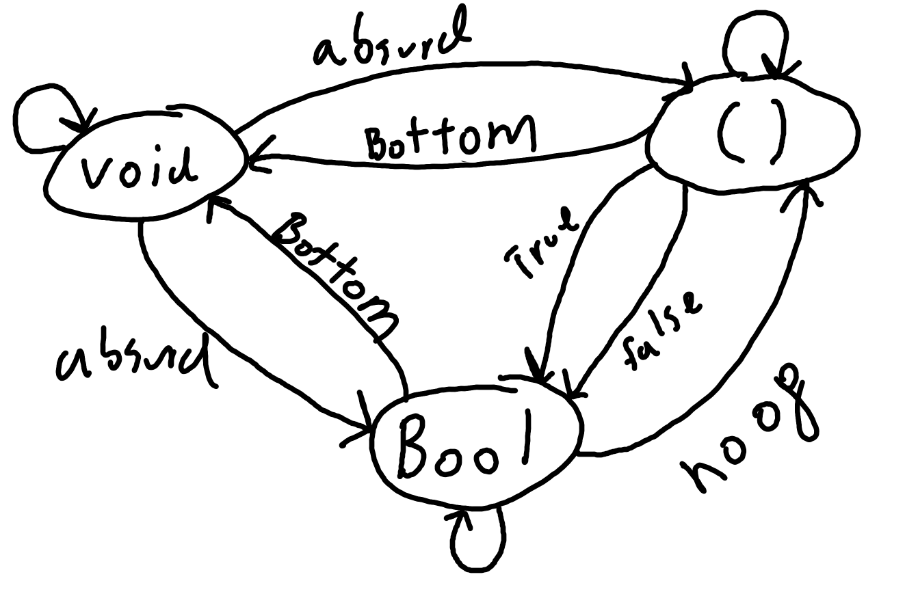

# 1
see `cat.rs` for implementation.

# 2
Memoizing an RNG works only in as far as [xkcd 221](https://xkcd.com/221/) works as a random number generator.

This unit test will pass
```rust
extern crate rand;

use rand::Rng;

fn f<T>(x: T){
	let mut rng = rand::thread_rng();
	rng.gen()
}

let mut mem = cat::Memoize::new(f);

let one_true_random_value = mem.eval(());

assert_eq!(one_true_random_value,mem.eval(()));
assert_eq!(one_true_random_value,mem.eval(()));
assert_eq!(one_true_random_value,mem.eval(()));
```

# 3
Memoizing an PRNG over it's seed will work as expected, as these are ultimately deterministic functions that walk through a chaotic sequence with (hopefully) nice statistical properties.

A true RNG library that draws entropy from some external source will fail the same as in #2, as again we are not capturing all of the side effecting inputs to the RNG. Typically these won't take a seed as they are just readers from an entropy source, but they are sometimes padded out with "cheaper" PRNG seeded on the (hopefully) true RNG.

# 4
## a
```c
	int fact(int n) {
	int i;
	int result = 1;
	for (i = 2; i <= n; ++i)
		result *= i;
	return result;
}
```
or 
```haskell
fact n = product [1..n]
```
are pure functions. They has no side effects, can be memoized, etc.


## b
`std::getchar()` reads from stdin, which is impure. who knows what you'll get.

## c
```c++
bool f() {
	std::cout << "Hello!" << std::endl;
	return true;
}
```
This is not a pure function, it has output as a side effect.

## d
```c++
int f(int x) {
	static int y = 0;
	y += x;
	eturn y;
}
```
local static is considered harmful 😭.
This is impure as it mutates state.

# 5
there are 4 pure functions from bool to bool:
```rust
fn alwaysTrue(x: bool) -> bool{
	return true
}

fn alwaysFalse(x: bool) -> bool{
	return false
}

fn id(x: bool) -> bool{
	return x
}

fn not(x: bool) -> bool{
	return !x
}

```

however there are infinite functions from bool to bool that are impure, e.g. xor with a random bool.

# 6

