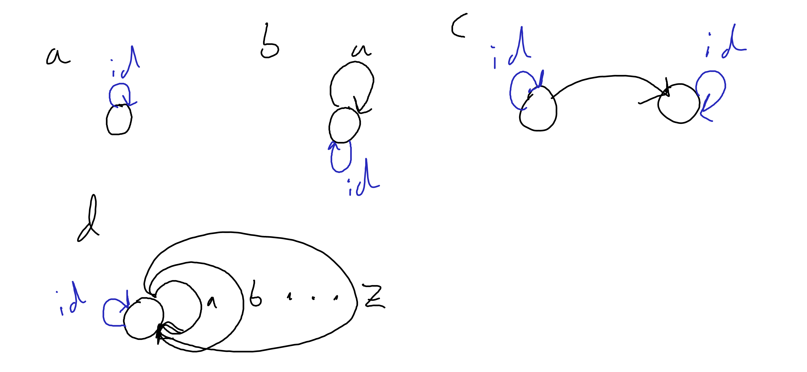
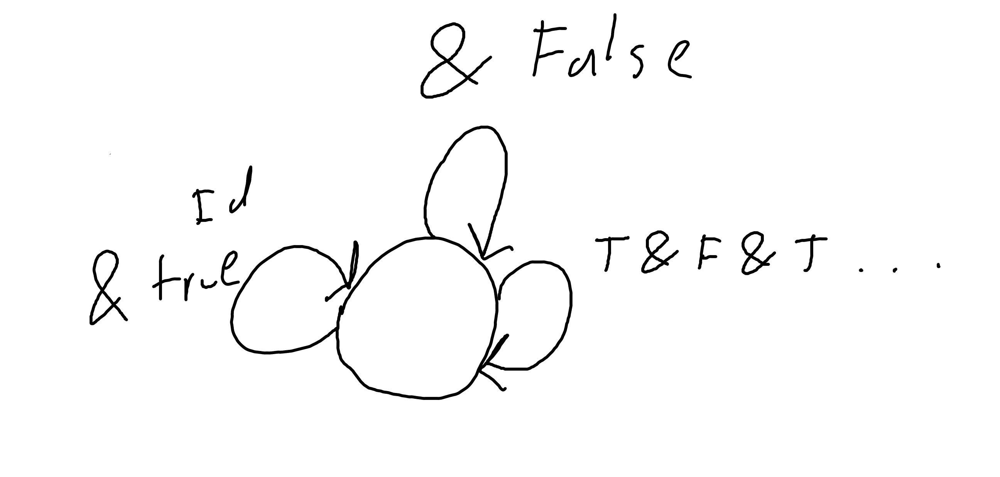
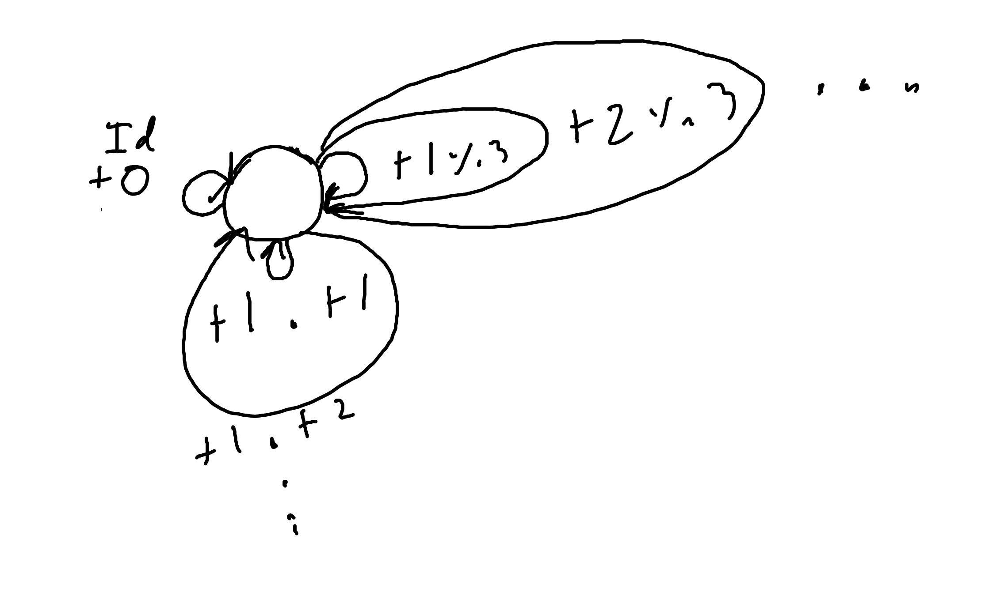

# 1

for b note that we have infinite morphisms for the infinite compositions of the single edge with itself.

for d note that we have infinite morphisms composed of the compositions of the 26 letters corresponding to all possible strings of characters.

# 2
## a
A total order. for all A, B, A is either in B or not in B. A in B and B in A is the definition of set equality. A in B and C in A -> C in B. 

## b
sub-typing is associative, so it is at least a preorder. if A can be passed to f(B) and B can be passed to g(B) than A must be B, so it is at least a postorder. however it is not a total order as c++ does not have a 'root type' such as object in Java, if I recall correctly.

# 3
## && operator
neutral element is True, && is associative (a && b) && c = a && (b && c)

## || operator

neutral element is False, && is associative (a || b) || c = a || (b || c)

# 4

Note that again, we have infinite morphisms corresponding to all possible & functions

# 5

note that we have infinite morphisms corresponding to adding every real number.
