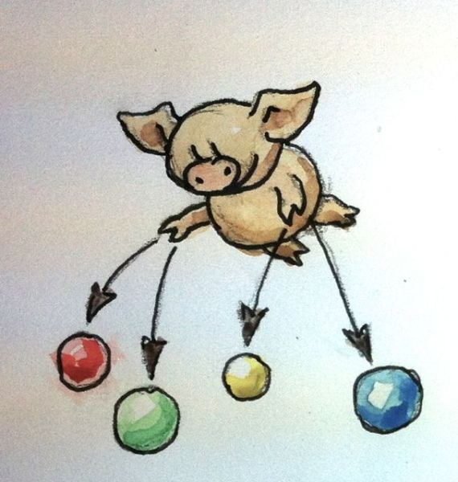
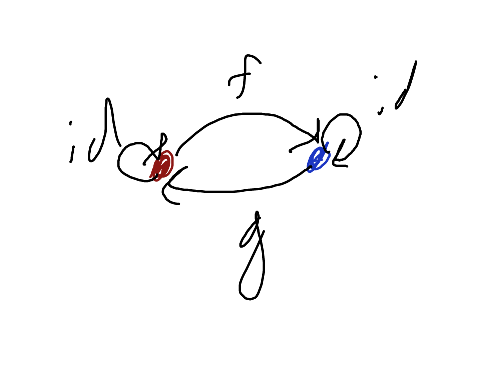
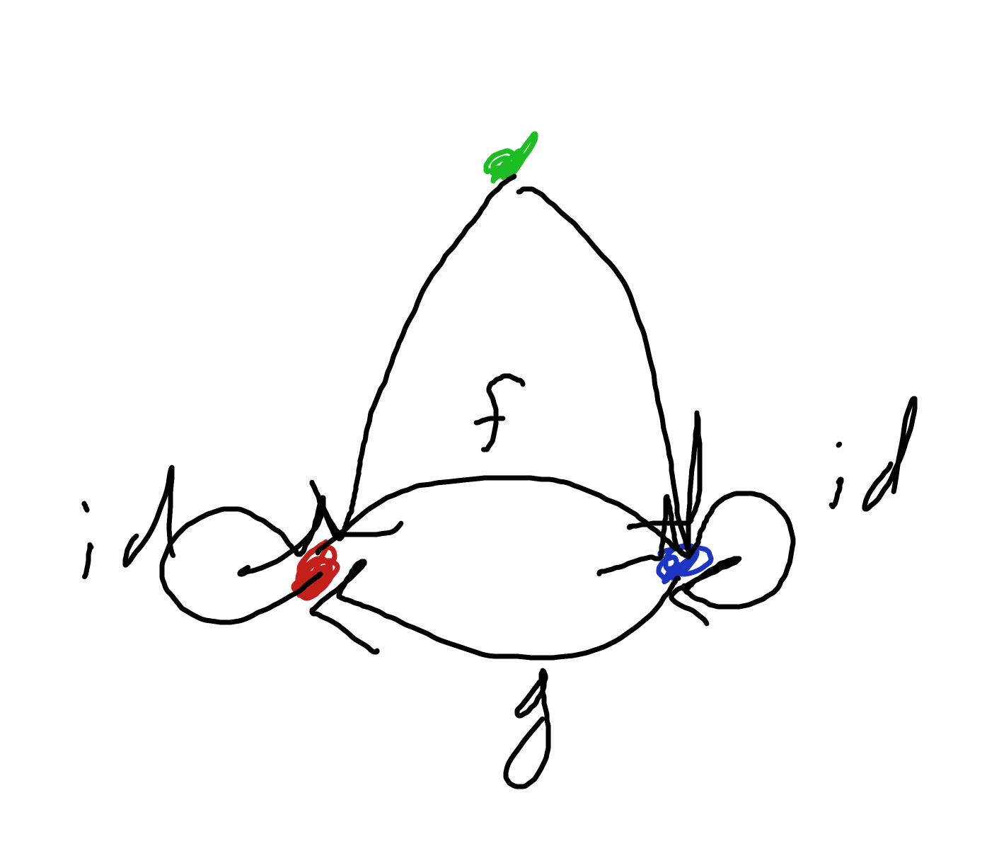

Before we get started can I say how much I love these cute illustrations


# 1

the example used in this chapter for the uniqueness of the initial object up to unique isomorphisms also applies to the terminal object. note that both objects have 1 and only 1 morphisms coming to them from any other object in the category. additionally, the composition of f . g and g . f are both still identity morphisms for the respective objects. 

I'm not going to lay out a rigorous proof at the moment, but it should be intuitive that increasing the category shown in the example from 2 to n objects with unique morphisms between all object pairs is the only way to have all objects be initial or terminal. 

## a digression
Question: is it possible to define multiple initial objects without having them also be terminal? 



Yes, but at least one object in the category must not be either initial or terminal. This breaks the highly symmetric tie shown in this diagram.

Note the green object "forces" the red and blue to be terminal, as opposed to zero/null objects.

From the wikipedia article on [https://en.wikipedia.org/wiki/Initial_and_terminal_objects](initial and terminal objects): 

```

If an object is both initial and terminal, it is called a zero object or null object. A pointed category is one with a zero object.
```


# 2

the product of two objects A and B in a posset is the "smallest" object "larger" than both of A and B.

# 3
the coproduct of two objects A and Bin a posset is the "largest" object "less" than both A and B.

# 4
here is a bare-bones implementation. note that rust does have an either crate that used to be part of the core language, or may soon be part of the core language? I'm a little unclear what the forum discussions are saying about it.

```rust
#[derive(Copy, Clone)]
pub struct Either<L,R> {
	left: Option<L>,
	right: Option<R>
}

impl<L,R> Either<L,R>
	{
	pub fn left(val: L) -> Either<L,R>{
		Either{
			left: Some(val),
			right: None
		}
	}

	pub fn right(val: R) -> Either<L,R>{
		Either{
			left: None,
			right: Some(val)
		}
	}

	pub fn is_left(self) -> bool{
		self.left.is_some()
	}
	pub fn is_right(self) -> bool{
		return self.right.is_some()
	}

	pub fn get_left(self) -> L{
		return self.left.unwrap()
	}

	pub fn get_right(self) -> R{
		return self.right.unwrap()
	}
}
```

# 5
A and B are equipped with the injections
```c
int i(int n) { return n; }
int j(bool b) { return b ? 0: 1; }
```

```rust
fn m(e: Either<int,bool>) -> i64{

}
```

# 6
because either factorizes i and j, it provides the functionality of both I and j with a single injection.

# 7
```c
int i(int n) {
	if (n < 0) return n;
	return n + 2;
}
int j(bool b) { return b ? 0: 1; }
```

can again be factorized with
```rust
fn m(e: Either<int,bool>) -> i64{
	if e.is_left(){
		return i(e.get_left())
	}
	else{
		return j(e.get_right())
	}
}
```


# 8
the tuple `(int,bool)` is an inferior coproduct because it admits 2 morphism, fist and second, to Either

