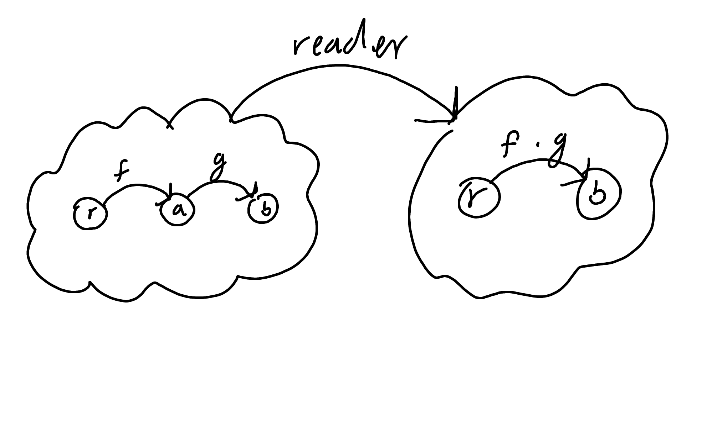

#1
Can we turn the Maybe type constructor into a functor by defining:
`fmap _ _ = Nothing`
which ignores both of its arguments? (Hint: Check the functor
laws.)

This is a functor, and it maps all objects to the the same Nothing object. it also maps all morphisms to the id morphisms. this respects composition, images of all morphisms are mapped correctly.

#2
Prove functor laws for the reader functor. Hint: it’s really simple.



types r and b are mapped to themselves, with a being removed from the mapping. it's easy to show that composition is respected because the reader function is by definition just composition in the source category. The above diagram is simplified and does not include identity morphisms or all compositions.

#3
Implement the reader functor in your second favorite language
(the first being Haskell, of course).


```rust
pub fn reader<R,A,B>(f: impl Fn(R)->A, g: impl Fn(A)-> B) 
	-> impl Fn(R)->B{
	move |x| g(f(x))
}
```

I feel like I may be missing something here as this is the same as generalized function composition. I believe that this meets the technical definition of the reader functor, but because the point of reader is to capture a source of (likely side effecting) values of type A.

I feel like this would be fit the goal better as running over generators.


## Some notes on functors in rust

Rust doesn't seem to permit fully abstracting higher kinded types. what this means (afaik) is that while we can instantiate specific instances of what functors yield (i.e. functions abstracted over type, or generics), we can't make functors themselves (i.e. functions abstracted over generics).

This means that I can implement the reader functor, but I'm not currently declaring it to be an implementation of something (i.e. it's not an impl of a functor trait).

There are some discussions of creating functor traits, but it seems that higher kinded types aren't coming down the pipeline any time soon.

[Idiomatic Monads in Rust](https://varkor.github.io/blog/2019/03/28/idiomatic-monads-in-rust.html) is a good introduction to the topic.

#4
Prove the functor laws for the list functor. Assume that the laws
are true for the tail part of the list you’re applying it to (in other
words, use induction).

A list element contains 2 values, the head, and the rest of the list.

An the head of a list(A) contains one of two possible values:
1) Just A, i.e. a value
2) None (or Nil)

### Case 1: Just A
Here List maps A to List(A), and F(A) to List(F(A)). All objects are mapped one to one to List, as are the morphisms. in particular, composition in list is just List(G(F(A))) so long as G and F compose.


### Case 2: None
None maps all objects in the source category to (), and all morphisms to identity. composition of morphisms is respected as id composes with itself. 

So List is functorial over the head. The list can then be recursively traversed by the same argument.

Can you tell that it's been a while since I've had to formally structure a recursive argument?